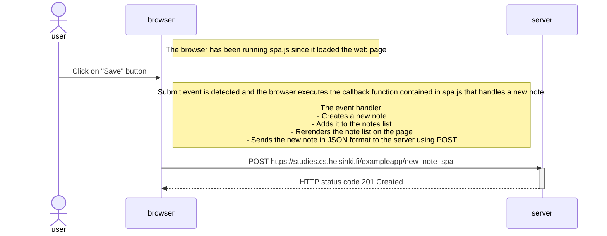

```mermaid
sequenceDiagram
    actor user
    participant browser
    participant server

    Note right of browser: The browser has been running spa.js since it loaded the web page

    user->>browser: Click on "Save" button

    Note right of browser: Submit event is detected and the browser executes the callback function contained in spa.js that handles a new note.<br/><br/>The event handler:<br/>- Creates a new note<br/>- Adds it to the notes list<br/>- Rerenders the note list on the page<br/>- Sends the new note in JSON format to the server using POST

    browser->>server: POST https://studies.cs.helsinki.fi/exampleapp/new_note_spa
    activate server
    server-->>browser: HTTP status code 201 Created
    deactivate server
```